# GNSSSignalSim GUI

**Author:** Muhammad Qaisar Ali
**GitHub:** https://github.com/MuhammadQaisarAli

A comprehensive PyQt6-based graphical user interface for configuring GNSS signal simulation parameters of the `IFdataGen` generator in [SignalSim](https://github.com/MuhammadQaisarAli/SignalSim). This application provides an intuitive workflow for creating, editing, and validating configuration files for GNSS signal simulators with support for multiple constellations and advanced trajectory modeling.


## Features

- **Intuitive Tabbed Interface**: A clean, organized workspace with dedicated tabs for each step of the configuration process: Basic Info, Ephemeris & Time, Trajectory, Signal Selection, Signal Power, and Output Settings.

- **Real-time JSON Preview**: Instantly see the generated JSON configuration as you modify settings, providing immediate feedback and ensuring correctness.

- **Smart Workflow Validation**: A step-by-step guidance system with intelligent validation that provides real-time feedback, warnings, and suggestions to ensure a valid configuration.

- **Comprehensive Ephemeris Management**:
  - Load multiple RINEX ephemeris files.
  - Automatic parsing of ephemeris files to determine validity ranges and supported constellations.
  - Visual validation of simulation time against ephemeris validity.
  - Auto-select simulation time based on ephemeris file data.

- **Advanced Trajectory Modeling**:
  - Define static or dynamic trajectories with multiple segments.
  - Support for various motion types (e.g., constant velocity, acceleration).
  - Interactive map integration using Folium for visual trajectory planning.
  - Click-to-set initial position and trajectory points on the map.
  - Geolocation search to easily find and set coordinates.
  - Preset locations for quick setup.

- **Flexible Signal Configuration**:
  - Support for major GNSS constellations: GPS, GLONASS, Galileo, and BDS.
  - Detailed signal selection table with frequency, bandwidth, and description.
  - Quick selection and deselection of all signals.

- **Detailed Power Control**:
  - Configure noise floor and initial signal power (C/N0).
  - Enable elevation-based power adjustments.
  - Set per-satellite power levels for fine-tuned scenarios.

- **Satellite Masking**:
  - Set an elevation mask to exclude low-elevation satellites.
  - Manually mask specific satellites from the simulation.

- **Flexible Output Options (When used with [SignalSim](https://github.com/MuhammadQaisarAli/SignalSim))**:
  - Generate IF data files (IQ8, IQ4).
  - Generate position files (KML, NMEA).
  - Generate observation files (RINEX).
  - Configure sample frequency, center frequency, and output interval.

- **Template Management**:
  - Save and load configuration templates to reuse common setups.
  - Manage custom templates.

- **Application Preferences**:
  - Customize default paths for configurations, ephemeris, and outputs.
  - Configure auto-save settings.
  - Set logging levels for both file and console output.

- **IFDataGen Integration**: Direct integration with `IFDataGen.exe` for signal generation (TBD).

## Quick Start - Running the GUI

### Prerequisites

- Python 3.13 or higher
- Windows/Linux/macOS

### Installation and Launch

1. **Install UV Package Manager** (PowerShell/Terminal):

   ```powershell
   # Windows (PowerShell)
   powershell -c "irm https://astral.sh/uv/install.ps1 | iex"

   # Linux/macOS
   curl -LsSf https://astral.sh/uv/install.sh | sh
   ```

2. **Clone and Run**:

   ```bash
   git clone https://github.com/MuhammadQaisarAli/GNSSSignalSimGUI.git
   cd GNSSSignalSimGUI
   uv run src/main.py
   ```

The GUI will launch automatically with all dependencies managed by UV.

> **Note:** Internet connection required to download dependencies.

## Application Workflow & State Machine

The application follows a structured workflow from configuration to signal generation:

```mermaid
graph TD
    A[🚀 Application Start] --> B[📋 Basic Information]
    B --> C[📡 Load Ephemeris Files]
    C --> D[⏰ Time Configuration]
    D --> E{Time Valid?}
    E -->|✅ Yes| F[🛰️ Trajectory Setup]
    E -->|❌ No| G[⚠️ Time Warning]
    G --> H[Adjust Time or Load New Ephemeris]
    H --> D
    F --> I[📶 Signal Selection]
    I --> J[⚡ Power Configuration]
    J --> K[📤 Output Settings]
    K --> L[💾 Save Configuration]
    L --> M[🎯 Generate Signals]
    M --> N[✨ Signal Generation Complete]
  
    style A fill:#e1f5fe
    style B fill:#f3e5f5
    style C fill:#e8f5e8
    style D fill:#fff3e0
    style E fill:#ffebee
    style F fill:#e0f2f1
    style G fill:#ffcdd2
    style H fill:#fff9c4
    style I fill:#e3f2fd
    style J fill:#f1f8e9
    style K fill:#fce4ec
    style L fill:#e8eaf6
    style M fill:#e0f7fa
    style N fill:#c8e6c9
```



### Detailed Workflow States

#### 1. **Application Initialization** (`src/main.py`)

- **Entry Point**: `main()` function
- **State**: Application startup and UI initialization
- **Actions**:
  - Setup QApplication with high DPI support
  - Initialize MainWindow with tabbed interface
  - Load application settings and preferences
  - Setup workflow managers (standard + smart validation)

#### 2. **Basic Information** (`BasicTab`)

- **State**: Project metadata configuration
- **Validation**: Always valid (optional information)
- **User Actions**: Set project description, version, and metadata
- **Next**: Automatically proceeds to ephemeris loading

#### 3. **Ephemeris Loading** (`EphemerisTimeTab`)

- **State**: Load RINEX ephemeris files
- **Validation**: Check file existence and validity
- **User Actions**:
  - Browse and select ephemeris files
  - View ephemeris validity ranges
- **Smart Feedback**: File count and validity status
- **Next**: Time validation (automatic)

#### 4. **Time Validation** (`EphemerisTimeTab`)

- **State**: Configure simulation time within ephemeris range
- **Validation**: Time must be within ephemeris validity window
- **User Actions**:
  - Set start time and duration
  - Adjust time if outside valid range
- **Visual Feedback**: Green checkmark (valid) or red warning (invalid)
- **Next**: Trajectory configuration

#### 5. **Trajectory Configuration** (`TrajectoryTab`)

- **State**: Define receiver movement path
- **Validation**: Position and trajectory segments
- **User Actions**:
  - Set initial position (static mode)
  - Add trajectory segments (dynamic mode)
  - Use interactive map for positioning
- **Options**: Static position or multi-segment dynamic trajectory
- **Next**: Signal selection

#### 6. **Signal Selection** (`SignalSelectionTab`)

- **State**: Choose GNSS constellations and signals
- **Validation**: At least one signal must be selected
- **User Actions**:
  - Enable/disable constellations (GPS, GLONASS, Galileo, etc.)
  - Select specific signals within each constellation
- **Smart Feedback**: Signal count and constellation summary
- **Next**: Power configuration

#### 7. **Power Configuration** (`PowerTab`)

- **State**: Configure signal power levels
- **Validation**: Power settings validation
- **User Actions**:
  - Set noise floor and initial power
  - Configure elevation-based power adjustments
- **Default**: Uses reasonable default values
- **Next**: Output settings

#### 8. **Output Settings** (`OutputSettingsTab`)

- **State**: Configure output file and format
- **Validation**: Output filename must be specified
- **User Actions**:
  - Set output filename and path
  - Configure file format options
  - Set sampling parameters
- **Next**: Ready for signal generation

#### 9. **Signal Generation** (`IFDataGenIntegration`)

- **State**: Execute IFDataGen.exe with configuration
- **Prerequisites**: All previous steps completed and configuration saved
- **Process**:
  - Validate IFDataGen.exe availability
  - Save configuration to JSON file
  - Launch IFDataGen.exe in background thread
  - Monitor progress and provide real-time feedback
- **Output**: Generated signal files

### Smart Workflow Management [TBD]

The application implements two workflow managers:

1. **Standard Workflow Manager** (`WorkflowManager`):

   - Tracks step completion status
   - Manages tab enabling/disabling
   - Provides basic validation feedback
2. **Smart Workflow Manager** (`SmartWorkflowManager`):

   - Non-blocking guidance system
   - Intelligent validation with helpful suggestions
   - Progress tracking with completion percentages
   - Real-time status updates in the status bar

### State Transitions and Validation

Each workflow step has multiple validation levels:

- **SUCCESS** ✅: Step completed correctly
- **WARNING** ⚠️: Issues present but can proceed
- **ERROR** ❌: Critical issues requiring attention
- **INFO** ℹ️: Helpful information
- **INCOMPLETE** ○: Step not yet completed

The application allows free navigation between tabs while providing intelligent guidance about the recommended workflow sequence.

## Project Structure

``` bash
GNSSSignalSimGUI/
├── .gitignore
├── .python-version
├── pyproject.toml
├── README.md
├── uv.lock
├── data/                     # Data files for the application
│   ├── configs/              # Default and user-saved configurations
│   └── ephemeris/            # Sample RINEX ephemeris files
├── docs/                     # Project documentation
│   └── specifications/       # Technical specifications and design documents
└── src/                      # Source code
    ├── core/                 # Core application logic (non-GUI)
    │   ├── config/           # Configuration models, validation, and templates
    │   ├── data/             # Data processing (RINEX parsing, time conversions)
    │   ├── integration/      # Integration with external tools (e.g., IFDataGen)
    │   ├── utils/            # Utility modules (logger, settings, version)
    │   └── workflow/         # Workflow and state management
    ├── gui/                  # Graphical User Interface components
    │   ├── dialogs/          # Dialog windows (About, Preferences, etc.)
    │   ├── resources/        # GUI assets (icons, etc.)
    │   ├── tabs/             # Main configuration tabs
    │   └── widgets/          # Custom widgets (e.g., embedded map)
    └── tests/                # Application tests
```

## Advanced Features

### Template System

- Save frequently used configurations as templates
- Quick loading of predefined setups
- Template management dialog

### Interactive Map Integration

- Folium-based map widget embedded in PyQt6
- Click-to-set trajectory points
- Real-time trajectory visualization

### Real-time Configuration Preview

- Live JSON preview updates as you configure
- Syntax highlighting and formatting
- Export/import configuration files

### Intelligent Validation

- Context-aware validation messages
- Helpful suggestions for resolving issues
- Progress tracking across all workflow steps

## Documentation

> **REFERENCES:**

- [JSON Format Specification](docs/specifications/SignalSim%20JSON%20format%20specification.pdf)
- [Design Description](docs/specifications/SignalSim%20Design%20Description.pdf)

from [SignalSim](https://github.com/globsky/SignalSim).

## Contributing

Contributions are welcome! Please feel free to submit a Pull Request.

## License

This project is licensed under the MIT License - see the LICENSE file for details.

---

## Changelog

### 2025

- 2025/07/01 [Version 1.0.0]
  - Initial release with complete workflow implementation
  - PyQt6-based GUI with tabbed interface
  - Smart workflow management with intelligent validation
  - IFDataGen.exe integration for signal generation
  - Interactive map integration for trajectory planning
  - Template system for configuration management
  - Real-time JSON configuration preview
  - Multi-constellation GNSS signal support
  - RINEX ephemeris file processing
  - Comprehensive error handling and user guidance
